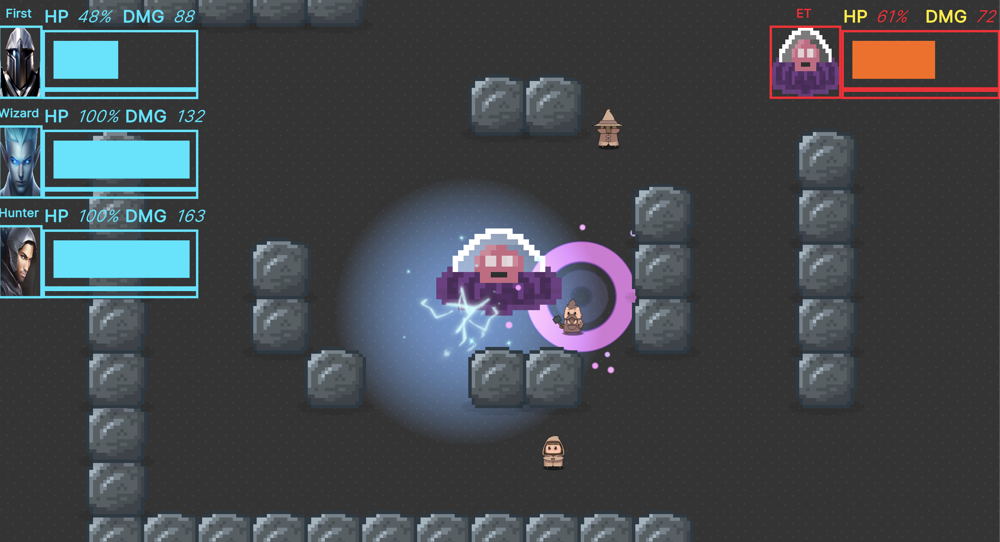

# 프로필  
## 이런 개발자입니다
- <b>게임 개발 과정에서 협업이 중요하다는 것을 알고, 동료 직원들과의 협업을 위한 고민을 많이 합니다.</b>  
- <b>개인 업무에 그치지 않고 동료의 업무를 도우며 팀에 일이 주어지면 먼저 나서서 일을 받아 수행합니다.</b>
- <b>새로운 기술에 대한 학습과 도전을 멈추지 않습니다. </b>

### Contact
- Email.  kyaya12345@gmail.com

### Channel
- Blog.  https://chocobubble.github.io/
- GitHub.  https://github.com/chocobubble/

## 🔍 핵심 역량

> 💡 다중 플랫폼 개발 경험
> 
- Android, iOS, macOS 플랫폼 빌드 환경 유지보수 및 구축
- 크로스 플랫폼 딥링크 기능 구현
- 외부 SDK 통합 및 최적화

> 💡 빠른 프로토타입 개발
> 
- 2주 내 Match-3 게임 프로토타입 개발
- 다양한 게임 엔진(Unity, Unreal Engine) 활용 경험

> 💡 자동화 시스템 구축
> 
- 코드 품질 분석 및 자동화된 코드 리뷰 시스템 개발
- 빌드 및 배포 프로세스 자동화
- AI 기술을 활용한 개발 생산성 향상

> 💡 새로운 기술 학습 및 적용
> 
- 다양한 프로그래밍 언어 및 프레임워크 학습
- 실험적인 기술 탐구 및 프로젝트 적용
- 지속적인 자기계발 및 기술 트렌드 연구

 

## 🛠️ 기술 스택

### 개발 언어

`C#` `C++` `Python` `Groovy` `Rust` `Java` `Objective-C`

### 게임 엔진

`Unity` `Unreal Engine`

### 도구 및 플랫폼

`Jenkins` `GitLab` `SonarQube` `Android` `iOS` `macOS`

### 자동화 및 AI

`CI/CD 파이프라인` `로컬 LLM` `AI API` `dotnet Roslyn` `강화학습`

 

## 기술 블로그
- 게임 클라이언트 프로그래머가 되기 위해 관련 지식을 책과 유데미 강의를 통해 쌓았습니다.
- 이를 정리하여 Github 블로그에 포스팅하고 있습니다.  
  

  

# 사이드 프로젝트

 

## 1️⃣ LS
> 자세한 프로젝트 관련 내용은 [하단](#ls) 혹은 [Github Wiki](https://github.com/chocobubble/LooterShooter/wiki)에서 확인 가능합니다.
### 개요
- 게임 장르 : looter shooter(TPS + RPG)  
- 제작 기간 : 2023. 6. ~ 10.
- 제작 인원 : 1인 (개인 프로젝트)
- 사용 엔진 : Unreal Engine v5.2 
- 언어 : C++
- 플레이 영상 : 
  - 이미지 클릭 시 유튜브에서 영상이 실행됩니다.  
    

### 프로젝트를 진행하면서 얻은 점
#### 1. GitHub의 Project, Issue, Wiki를 이용하여 프로젝트 관리를 했습니다.
  - 문제점
    -  프로젝트를 구체적 기획없이 개발을 시작하려고 하니 개발 우선순위 및 순서 결정 등의 어려운 부분이 있었습니다.
  - 해결 방안
    -  구현하려는 기능, 프로젝트의 전체적인 구조 등을 Github Projects를 이용해 시각적으로 계획하고 진행해나가니 이전 프로젝트 보다 더 효율적인 개발이 가능했습니다.
  - [GitHub Projects 링크](https://github.com/users/chocobubble/projects/2)
#### 2. 데이터 시스템을 구축하여 데이터를 코드와 분리하고, 비프로그래머도 수정이 가능하도록 했습니다.
  - 문제점
    -  처음에는 코드에 스탯 등 관련 데이터들을 넣어 하드코딩했습니다. 그러다 보니 프로젝트를 진행하며 각종 수치들을 변경할 때마다 매번 코드를 수정하고 다시 컴파일을 하느라 시간이 많이 소모되었습니다.
  - 해결 방안
    -  csv를 이용한 데이터 시스템과 블루프린트를 이용해 데이터를 코드와 분리하여 수치를 변경할 수 있도록 시스템을 구축했습니다.
  -  [코드 링크](https://github.com/chocobubble/LS/tree/main/Source/LooterShooter/System)
#### 3. 컴포넌트를 활용하여 방대해진 클래스의 크기를 줄이고, 다른 객체에 재활용했습니다.  
  - 문제점
    - 플레이어 캐릭터 클래스를 제작하면서 관련 기능 대부분을 한 클래스에 제작하다 보니 클래스가 너무 커져 유지 보수가 점점 어려워졌습니다. 그리고 같은 기능을 몬스터 클래스에도 재활용해야 하는 상황이 발생했습니다.
  - 해결 방안
    - 컴포넌트 디자인 패턴을 활용해 각 기능들을 분리하고 재활용했습니다. 
  - [코드 링크](https://github.com/chocobubble/LS/tree/main/Source/LooterShooter/Component)
#### 4. 유연하고 확장성 있는 기능 구현을 위해 다형성을 이용했습니다.
  - 문제점
    -  처음 스킬 구현 시 플레이어 캐릭터 클래스 내에 구현하고 시전을 했는데, 스킬을 추가할 때 기존의 코드를 활용하지 못해 클래스 크기가 비효율적으로 커지는 문제점이 있었습니다.
  - 해결 방안
    -  스킬 부모 클래스를 만들고 각 스킬의 세부사항은 자식 클래스로 구현한 뒤, 캐릭터는 부모 클래스의 스킬 시전 메서드만 호출하는 식으로 간소화했습니다.
  - [코드 링크](https://github.com/chocobubble/LS/tree/main/Source/LooterShooter/Skill)

 

## 2️⃣ MRid
> 자세한 프로젝트 관련 내용은 [하단](#mrid) 혹은 [노션](https://www.notion.so/MRid-12b24ec49c8b49c6ba6b304f169e12c4?pvs=4)에서 확인 가능합니다.  
### 개요
- 게임 장르 : simulation, management  
- 제작 기간 : 2023. 4. ~ 2023. 5.
- 사용 엔진 : Unity
- 언어 : C#

   

---

> 이하 각 프로젝트의 세부 설명입니다.

  

# LS

## 프로젝트 소개
> GitHub : [LS Project](https://github.com/chocobubble/LooterShooter)  
> Wiki : [LS Wiki](https://github.com/chocobubble/LooterShooter/wiki)

- 게임 장르 : looter shooter(RPG + TPS)  
- 제작 기간 : 2023. 6. ~ 현재
- 제작 인원 : 1인 (개인 프로젝트)
- 사용 엔진 : Unreal Engine v5.2 
- 언어 : C++

### 플레이 영상
- 이미지 클릭 시 유튜브에서 영상이 실행됩니다.

 

## 주요 내용

### 1. GitHub의 Project, Issue, Wiki 등을 이용한 프로젝트 관리
프로젝트 일정 및 목표 관리, 코드 기록 등의 필요성을 느끼고 GitHub의 Project, Issue, Wiki 등의 기능을 이용해 프로젝트를 제작했습니다. 

- Project
  - GitHub의 Project를 이용하여 프로젝트 일정을 관리 했습니다.
  
     

- Issue
  - GitHub의 Project에 들어가는 Issue들이며, Git Commit 과 연동해 각 Issue에 해당하는 Commit들을 바로 확인할 수 있었습니다.
  - 체크박스를 통해 세부 목표관리를 했습니다.
  
   

- Wiki
  - 프로젝트에서 구현한 기능들을 GitHub의 Wiki를 통해 정리했습니다.
  
   

 

### 2. 데이터 시스템을 구축을 통한 데이터와 코드의 분리
>  [[Wiki]](https://github.com/chocobubble/LS/wiki/%EB%8D%B0%EC%9D%B4%ED%84%B0-%EC%8B%9C%EC%8A%A4%ED%85%9C)
- 프로젝트 초기에는 무기나 캐릭터 스탯 등 수치들을 코드로 설정했고, 프로젝트가 진행되면서 이런 데이터를 수정할 때마다 코드 수정 과정에서 에러가 생기는 등의 문제가 있었습니다. 
- 해결 방법으로 데이터 시스템을 구축해했고, C++ 코드에 의존적이지 않게 데이터들을 관리할 수 있게 했습니다. 
- 또한 이렇게 구축한 데이터 시스템을 통해 비프로그래머도 프로그래머의 도움 없이 게임 내 데이터 수정이 가능합니다.

 

### 3. 클래스의 크기를 줄이고, 다른 객체에 재활용하기 위한 컴포넌트 활용
> [[Wiki]](https://github.com/chocobubble/LS/wiki/%EC%BB%B4%ED%8F%AC%EB%84%8C%ED%8A%B8)
- RPG 게임 특성상 캐릭터를 구현하는 클래스의 크기가 커져 수정 및 확장이 용이하지 않았습니다. 
- 이런 문제를 해결하기 위해 컴포넌트 기반 설계를 도입했습니다. 
- Defense, Resource, Equipment, Inventory 등의 기능을 컴포넌트로 분리했으며, 이를 몬스터 구현 등에 재사용했습니다. 
- 그리고 컴포넌트 간의 의존성을 줄이기 위해 delegate를 이용했습니다.

 

### 4. 유연하고 확장성 있는 기능 구현을 위한 다형성 활용
> [[Wiki]](https://github.com/chocobubble/LS/wiki/%EB%8B%A4%ED%98%95%EC%84%B1)
- 스킬을 추가하는 과정에서 캐릭터 클래스가 과도하게 커지는 경향이 있었고, 그 과정 속에서 에러가 발생하는 경우가 있었습니다.
- 해결 방안으로 다형성을 이용하여 유연하고 확장성 있게 부가 속성을 구현했습니다.
 
---

 

### 프로젝트 Wiki
> [[Document]](https://github.com/chocobubble/LooterShooter/wiki/Document)

- GitHub의 Wiki에 프로젝트에서 구현한 기능들을 정리했습니다.
- 아래 링크를 통해 확인 가능합니다.

### 프로젝트 소스 코드
> [[GitHub]](https://github.com/chocobubble/LooterShooter/tree/main/Source/LooterShooter)

- 프로젝트의 GitHub 링크입니다.

  

> [Back to Top](#프로젝트)

---

  

# MRid

> 노션에서 플레이 영상 등 더 자세한 내용 확인 가능합니다.  
> Notion: [Notion](https://www.notion.so/MRid-12b24ec49c8b49c6ba6b304f169e12c4?pvs=4)  
> GitHub: [GitHub](https://github.com/chocobubble/MRid-Demo)

## 프로젝트 소개
World of Warcraft와 Football Manager에서 아이디어를 가져왔습니다. 이 게임에서, 플레이어는 캐릭터들을 고용하고, 던전을 계속 반복해서 클리어하면서 캐릭터들을 성장시켜 최종적으로 마지막 던전을 클리어하는 것이 목표입니다. 전투는 AI로 진행됩니다. 던전에서 수집한 재화와 경험치를 이용해서 캐릭터들의 능력치를 업그레이드하며 더 강한 캐릭터를 고용하고 장비를 구매합니다.
- 게임 장르 : simulation, management  
- 제작 기간 : 2023. 4. ~ 2023. 5.
- 사용 엔진 : Unity
- 언어 : C#

---
  

## 주요 내용

### A* 알고리즘 (Pathfinding)
> [코드](https://github.com/chocobubble/MRid-Demo/blob/c740b89cce617a8ed84291c1c60390f7515a89d4/Assets/Scripts/Pathfinding.cs)

- 던전의 맵을 tile과 grid를 이용해 구현했는데, tile이 많아질수록 BFS를 통한 AI 경로찾기의 시간 복잡도가 매우 커져 더 효율적인 알고리즘은 A* 알고리즘을 이용해 AI 경로찾기를 구현했습니다.
- GameScene의 던전을 tile map과 grid를 이용하여 나누고 이동 가능한 노드들을 미리 세팅해 둔 후, 회피 길찾기 메소드와 공격 길찾기 메소드로 크게 나누었습니다.
- 회피 메소드는 해당 위치 까지 가는 최소 거리를 구하고 그 경로를 list로 반환합니다
- 공격 길찾기 메소드는 공격 타겟까지 가는 거리 중 공격 가능 범위에 들어오는 node 발견 시 해당 노드까지의 경로를 list로 반환합니다

### AI 로직 (AllyCtrl)
> [코드](https://github.com/chocobubble/MRid-Demo/blob/c740b89cce617a8ed84291c1c60390f7515a89d4/Assets/Scripts/AllyCtrl.cs)

- 캐릭터들의 상태는 STAY, ATTACK, MOVE 로 구분했습니다.
- 캐릭터들은 responseSpeed * 1초 만큼의 시간을 주기로 행동을 결정합니다.
    - 먼저 현재 위치가 범위스킬안에 포함되어 있는 지 확인하고, 그렇다면 범위 밖으로 이동할 곳을 찾아 이동합니다.
    - 범위스킬안에 포함되어 있지 않다면 공격 대상과의 거리를 계산합니다.
        - 대상과의 거리가 공격 가능 거리 이내라면 공격합니다
        - 그렇지 않다면 공격 가능 거리 이내까지 이동 합니다.
- 적은 공격 스킬 사용 시 모든 아군 캐릭터들에게 이벤트가 발생했음을 알립니다. 판단 코루틴 함수를 정지시키고 다시 판단 코루틴 함수를 호출해서 즉각 이벤트에 반응하게 합니다.
- 캐릭터는 이동 대상 위치 까지의 루트를 A* 알고리즘으로 부터 list로 받아 list를 탐색하며 움직입니다.
- 공격 상태에서는 스킬을 먼저 사용합니다. 스킬에는 시전시간이 있으며 이 시간동안 캐릭터는 움직일 수 없습니다. 쿨타임이라 스킬 사용이 가능하지 않다면 기본공격을 합니다.

  

## 게임 설명

### 캐릭터

- scriptable object(CharacterSO)와 prefab을 이용하여 캐릭터들을 구성하였습니다. 캐릭터의 scriptable object는 크게 두가지로 나누었습니다. 하나는, 캐릭터 직업별 베이스 스탯을 나타내는 scriptable object입니다. 다른 하나는, 게임 실행 중 scene 간의 이동에 있어 유지되어야 하는 데이터들을 보관하는 scriptable object로, 인게임 중에 scriptable object를 인스턴스화하여 사용합니다.
- prefab도 캐릭터 직업별 베이스를 구성하는데 사용하였습니다.
- 캐릭터를 구성하는 script는 두가지 입니다. 하나는 AllyCtrl 로, 전투 시 캐릭터의 움직임을 구사하며, 다른 하나는 ChracterStats로, 전투 시 일시적으로 변하는 스탯들을 보관합니다.

### 장비

- scriptable object(EquipmentSO)를 이용하였습니다

### UI

- Unity UI Toolkit 을 이용하여 제작하였습니다.

### Main Screen

- Main Screen은 Dungeon Screen, Shop Screen, Pub Screen, Inventory Screen, Prepare Screen 으로 구성되어 있으며, 화면 왼쪽의 TabBar를 통해 스크린 간의 전환이 이루어집니다.

### Dungeon Screen

- 던전 및 그 던전의 어려움 정도를 결정하는 화면입니다.
- start 버튼을 누르면 Prepare Screen UI가 팝업됩니다.
- 게임 진행도에 따라 표시되는 던전의 종류와 어려움 정도가 다릅니다. LevelSO scriptable object에 의해 결정됩니다.
 
    []

### Prepare Screen

- dungeon screen 에서 start 버튼을 누르면 이 screen이 팝업되어 나타납니다.
- 보유하고 있는 캐릭터 중 원하는 멤버를 골라 전투에 참여시킵니다.  
    []

### Shop Screen

- 장비는 무기와 갑옷으로 이루어져 있으며, scriptable object(EquipmentSO)로 다룹니다.
- 무기와 갑옷을 베이스로, 3종류의 레어도 모두 랜덤으로 결정되어 shop에 나타납니다.
- 구매한 장비는 GameManager에서 List로 관리합니다.

   []

### Pub Screen

- pub에서 용병들을 고용하고, 퀘스트를 받습니다.
- 고용한 용병들은 GameManager 에서 List로 관리합니다.
- 퀘스트 클리어에 따라 시도할 수 있는 던전 종류가 늘어납니다.

   []

### Inventory Screen

- 보유하고 있는 장비, 캐릭터 들과 캐릭터들의 스탯을 볼 수 있습니다.
- 캐릭터들의 장비 전환이 가능합니다.

   []

### Game Scene

- Prepare screen 에서 start 버튼을 누르면 이 scene 으로 이동합니다.
- 아군과 적의 hp를 큰 막대바로 보여주고, 가한 데미지를 수치로, 스킬 시전시 아래의 작은 막대바가 차오릅니다.
- 아군 캐릭터들은 적의 범위 공격 스킬이 자신의 바닥 아래에 깔리면 범위에서 벗어나는 위치를 찾고 그 위치로 이동합니다.
- 공격가능한 범위에서 벗어나면 공격할 수 있는 거리 까지 이동하여 공격합니다.  
   []

  

> [Back to Top](#프로젝트)
